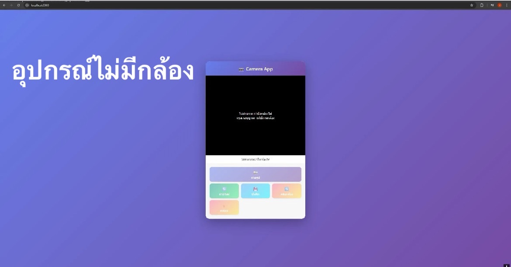

# Hybrid_2_project Camera Web Application

แอพพลิเคชันถ่ายรูปผ่านเว็บเบราว์เซอร์ พัฒนาด้วย HTML5, CSS3 และ JavaScript

##  Features

- ถ่ายรูปจากกล้องหน้า/หลัง
- สลับระหว่างกล้องหน้าและกล้องหลัง
- เปิด/ปิดไฟแฟลช (รองรับเฉพาะกล้องหลัง)
- ดูตัวอย่างรูปที่ถ่าย
- บันทึกรูปลงในเครื่อง
- รองรับการใช้งานบนมือถือและคอมพิวเตอร์

## 🖼 Screenshots

*หน้าแอพเมื่อเปิดกล้อง*

##  การติดตั้งและใช้งาน

### เปิดไฟล์โดยตรง
1. ดาวน์โหลดไฟล์ `index.html`
2. เปิดไฟล์ด้วยเว็บเบราว์เซอร์ (Chrome, Firefox, Safari, Edge)
3. อนุญาตการเข้าถึงกล้องเมื่อเบราว์เซอร์ถาม
